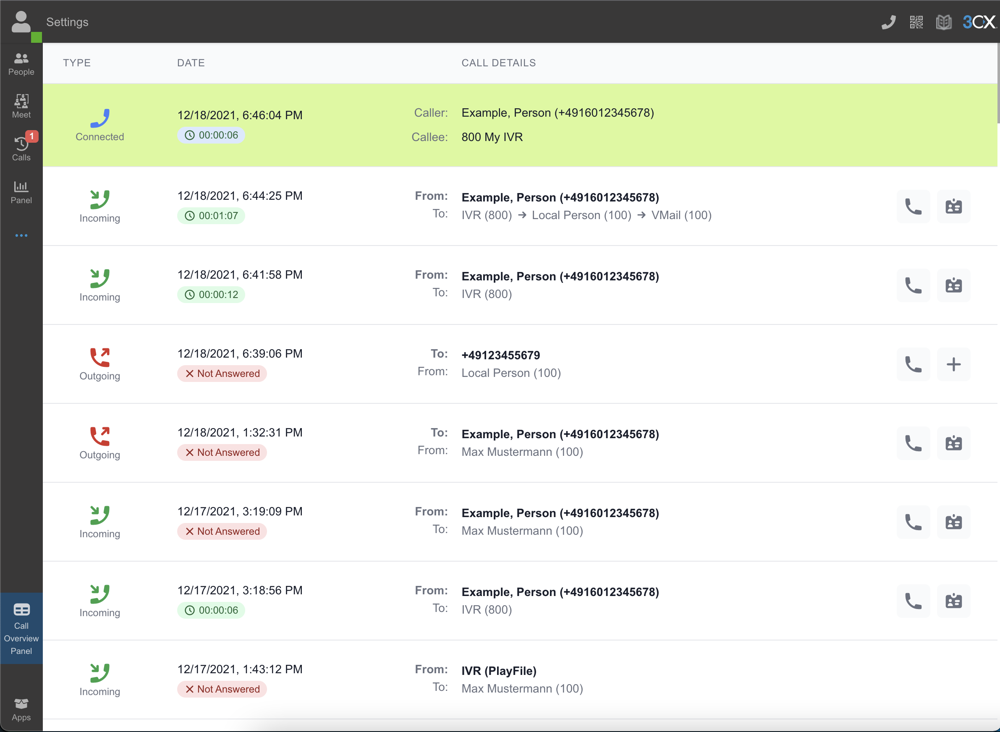

# Webclient Realtime Call Overview Panel

This is a plugin for the official webclient. 

Features:
* self-updating call history
* show the call chain
* show all active calls
* 3cx phonebook integration (caller name resolving, add new contact, edit existing contact)
* call integration (make call via button from history)

Supports internationalization. Included languages:
* English 🇺🇸🇬🇧
* German / Deutsch 🇩🇪

Tested on: v18.0.2.307



---

## Installation

### Automatic

Use the 3cx-tools-helper: https://github.com/adroste/3cx-tools

### Manual

1. Go to the webclient folder on your 3CX instance. It should be here: `/var/lib/3cxpbx/Data/Http/wwwroot/webclient`
2. Copy the contents of the `build`-folder into a new directory called `tcx-tools-panel-app` (inside the `webclient`-folder).
3. Make sure the files are owned by *phonesystem*: `chown -R phonesystem:phonesystem ./tcx-tools-panel-app/`.
4. Add the following script-tag to the end of the `<body>`-tag of the `index.html` file (inside the `webclient`-folder):

```html
<script src="/webclient/tcx-tools-panel-app/integrate-webclient.js"></script>
```

*Hint: It is possible that an update to the 3cx instance removes these changes.*